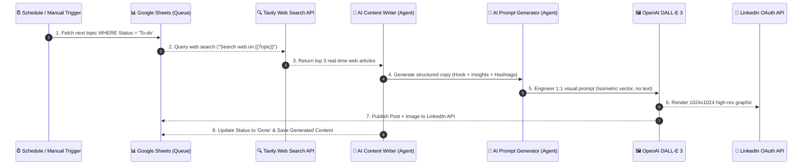
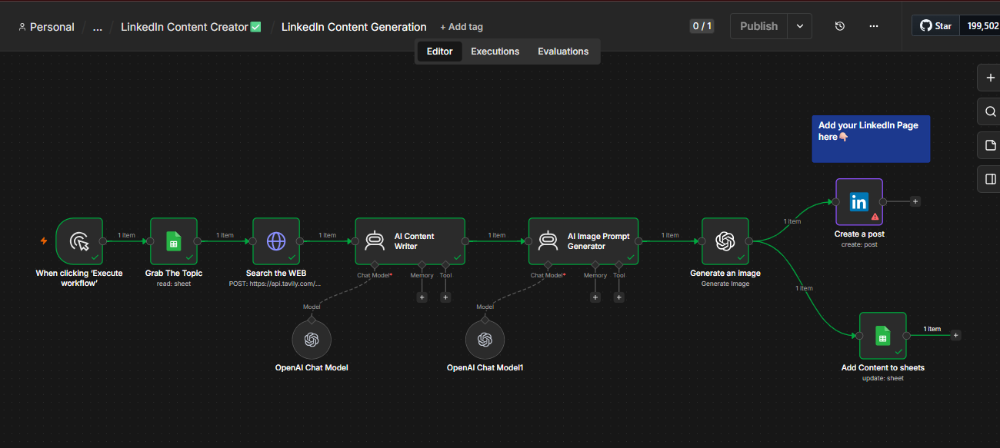
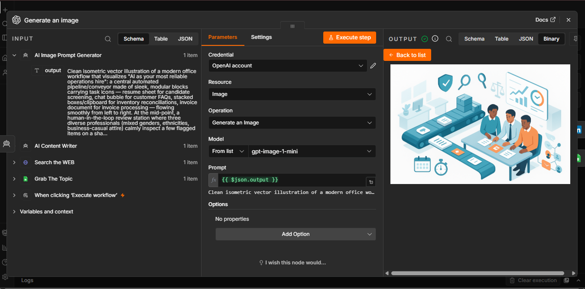
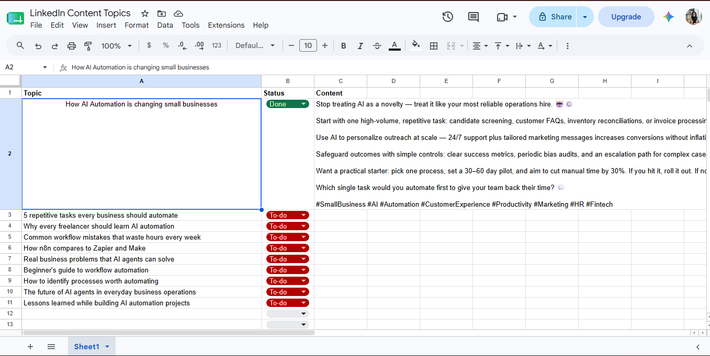

# 🚀 Autonomous AI LinkedIn Content & Graphic Generator

[](https://n8n.io)
[](https://openai.com)
[](https://tavily.com)
[](https://google.com/sheets)
[](https://linkedin.com)
[](LICENSE)

An end-to-end **Autonomous Content Generation Engine** built with **n8n**, **LangChain AI Agents**, **Tavily Real-Time Web Search**, and **DALL-E 3**. The system automatically pulls queued topics from a Google Sheet, performs real-time market research across news sources, crafts high-converting LinkedIn posts with custom AI graphics, logs outputs back to Google Sheets, and publishes directly to LinkedIn.

---

## 📌 Business Problem & Impact

Maintaining an active personal brand or corporate presence on LinkedIn requires consistent, high-quality content. However:
* ⏳ **Research Fatigue:** Finding fresh, accurate industry insights takes 1–2 hours per post.
* 🎨 **Visual Bottlenecks:** Designing matching 1:1 graphics or flat vector art for every post is time-consuming.
* 📉 **Inconsistent Posting:** Inconsistent scheduling lowers organic reach and audience engagement.

### 💡 The Solution
This workflow automates the entire content lifecycle:
1. **Automated Topic Ingestion:** Fetches upcoming topics from a centralized Google Sheets content calendar.
2. **Real-Time Web Intelligence:** Uses **Tavily AI Search** to crawl 3 live news articles per topic for fresh facts and trends.
3. **Multi-Agent Synthesis:**
   - **Agent 1 (Copywriter):** Synthesizes live web research into structured, viral LinkedIn copy (Hook, Insights, Emoji formatting, CTAs, Hashtags).
   - **Agent 2 (Prompt Engineer):** Converts post copy into visual metaphors for DALL-E / Flux image generation.
4. **Automated Graphic Creation:** Generates professional 1:1 flat vector graphics matching post themes.
5. **Direct Publishing & Archiving:** Posts live to LinkedIn API while updating Google Sheets status to `Done`.

---

## 🏗️ Architecture & Workflow Diagram



---

## 🖼️ Visual Workflow Showcase

### 1. n8n Autonomous Workflow Execution


### 2. AI Generated Graphic Output (DALL-E 3)


### 3. Google Sheets Content Queue Sync


---

## ⚡ Key Features

* **Automated Cron Scheduling:** Runs daily at 9:00 AM (or manual trigger on demand).
* **Live Web Grounding:** Uses Tavily AI Web Search to eliminate hallucinations and incorporate up-to-date industry news.
* **Dual-Agent Architecture (LangChain + OpenAI):**
  * **Writer Agent:** Enforces 150-250 word count, short paragraphs, strong opening hook, 3-6 emojis, and 5-8 relevant hashtags.
  * **Designer Agent:** Converts abstract topics (AI, workflow automation, ROI) into clean visual metaphors (flat vector, isometric corporate art, no text/watermarks).
* **Automated Image Rendering:** Generates custom 1:1 LinkedIn graphics via DALL-E 3 (`gpt-image-1-mini`).
* **Two-Way CRM Sync:** Reads `To-do` topics and updates status to `Done` with complete post archives.
* **Direct LinkedIn Publishing:** Posts text + image natively via LinkedIn OAuth credentials.

---

## 🛠️ Tech Stack & APIs

* **Workflow Orchestrator:** [n8n](https://n8n.io) (v1.x / Self-Hosted / Cloud)
* **AI Framework:** `@n8n/n8n-nodes-langchain` (LangChain Agents & LM Chat Models)
* **LLM Models:** OpenAI `gpt-4o-mini` / `gpt-4o`
* **Real-Time Web Search:** [Tavily API](https://tavily.com)
* **Image Generation Model:** OpenAI DALL-E 3 / GPT Image
* **Database & Content Queue:** Google Sheets API v4
* **Social Media API:** LinkedIn REST API v2

---

## 📂 Repository Structure

```text
LinkedIn-Content-Generator/
│
├── README.md                   # System Architecture & Technical Documentation
├── workflow.json               # Exported n8n Workflow File
├── .env.example                # Environment Variable Template
├── LICENSE                     # MIT Open Source License
│
├── prompts/
│   └── system_prompts.md       # AI Copywriter & AI Image Prompt System Prompts
│
└── docs/
    ├── setup.md                # Step-by-step Installation & Credentials Guide
    └── api_configuration.md    # Tavily, OpenAI, Google Sheets & LinkedIn API Specs
```

---

## 📋 Google Sheets Content Queue Schema

The workflow reads from and updates a single Google Sheet (`LinkedIn Content Topics`):

| Column Name | Type | Read/Write | Description | Example Value |
| :--- | :--- | :--- | :--- | :--- |
| `Topic` | String | Read | The post topic or keyword idea | `AI Agents in B2B Lead Qualification` |
| `Status` | Enum | Read / Write | Filter key (`To-do` -> `Done`) | `Done` |
| `Content` | Long Text | Write | AI-generated LinkedIn post copy | `🚀 AI agents are changing SDR outreach...` |

---

## 🚀 Quick Setup

1. Import `workflow.json` into n8n.
2. Add your **Tavily API Key** in the `Search the WEB` HTTP Request node.
3. Configure your **OpenAI API Key** in the LangChain Chat Model & Image Generation nodes.
4. Authorize your **Google Sheets OAuth** and select your Content Queue spreadsheet.
5. Connect your **LinkedIn OAuth** account.
6. Set a topic in Google Sheets with `Status = To-do` and click **Execute Workflow**!

*(For detailed setup steps, see [docs/setup.md](docs/setup.md))*

---

## 📜 License

This project is licensed under the [MIT License](LICENSE).
